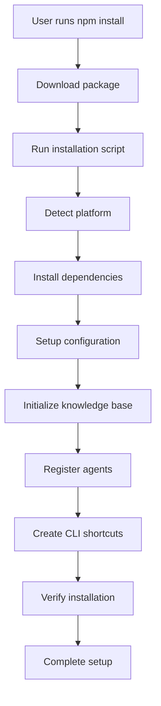

# Installable AI Brain - Strategic Implementation Plan

## Executive Summary

This document outlines the comprehensive strategy for transforming the existing Code Master AI Brain system into a fully installable, distributable AI brain that can be installed and used by AI agents. The current codebase represents a sophisticated, production-ready AI brain system with multi-agent orchestration, knowledge management, and professional integration capabilities.

## Current State Assessment

### ✅ **Existing Strengths**

**Core Architecture:**
- **Multi-Agent System**: Supporting 11+ AI models (OpenAI, Anthropic, Google, GitHub Copilot, etc.)
- **Knowledge Management**: Global coding standards, personal preferences, skills repository
- **Professional Integration**: VS Code extension, CLI interface, API connectors
- **Advanced Features**: Adaptive learning, analytics, automation, pattern recognition
- **Installable Foundation**: NPM package structure, CLI tools, documentation

**Technology Stack:**
- **Primary Languages**: JavaScript/Node.js, TypeScript, Bash/Shell
- **Frameworks**: Node.js runtime, VS Code Extension API, multiple AI platform APIs
- **Architecture**: Modular design, plugin architecture, multi-platform support

**Key Components:**
```
AI Brain System
├── Knowledge Management
│   ├── Global Knowledge Base
│   ├── Personal Preferences
│   ├── Skills Repository
│   └── Contextual Awareness
├── Multi-Agent Orchestration
│   ├── Agent Registry (11+ AI models)
│   ├── Intelligent Router
│   ├── Task Analyzer
│   └── Orchestration Controller
├── Integration Layer
│   ├── VS Code Extension
│   ├── CLI Interface
│   ├── GitHub Copilot Integration
│   └── API Connectors
└── Automation & Setup
    ├── Workspace Automation
    ├── Global Setup Scripts
    └── Installation Engine
```

### 🎯 **Target State**

**Installable AI Brain Features:**
1. **Persona System**: Customizable AI personality, learning styles, communication patterns
2. **Skills Repository**: Dynamic capability loading, agent marketplace integration
3. **Knowledge Base**: Portable configurations, version control, backup/sync
4. **Rule Engine**: Workflow enforcement, pattern recognition, proactive system
5. **Agent Integration Framework**: Standardized API for AI agent integration

## Strategic Implementation Plan

### Phase 1: Package Optimization (Week 1-2)

#### 1.1 NPM Package Refinement
**Objectives:**
- Optimize package.json for distribution
- Ensure proper dependency management
- Create comprehensive installation documentation

**Tasks:**
- [ ] Review and update package.json with proper metadata
- [ ] Add installation and usage scripts
- [ ] Create comprehensive README.md
- [ ] Add automated testing suite
- [ ] Implement semantic versioning

**Deliverables:**
- Optimized NPM package configuration
- Complete documentation set
- Automated testing framework

#### 1.2 Distribution Strategy
**Objectives:**
- Prepare for multi-channel distribution
- Create marketplace-ready packages
- Set up release automation

**Tasks:**
- [ ] Prepare NPM registry publishing configuration
- [ ] Create VS Code extension marketplace package
- [ ] Set up GitHub releases for binary distribution
- [ ] Configure CI/CD for automated releases

**Deliverables:**
- NPM registry publishing pipeline
- VS Code marketplace submission package
- GitHub release automation

### Phase 2: Installation Engine Enhancement (Week 2-3)

#### 2.1 Cross-Platform Installer
**Objectives:**
- Create unified installation experience
- Support all major operating systems
- Implement dependency auto-resolution

**Tasks:**
- [ ] Develop unified installation script
- [ ] Add Windows support (.exe installer)
- [ ] Enhance macOS support (.pkg installer)
- [ ] Optimize Linux support (.deb/.rpm packages)
- [ ] Implement dependency checking and auto-installation

**Deliverables:**
- Cross-platform installation scripts
- Automated dependency resolution
- Platform-specific installer packages

#### 2.2 Configuration Wizard
**Objectives:**
- Create interactive setup experience
- Enable persona customization
- Simplify API key management

**Tasks:**
- [ ] Build interactive configuration wizard
- [ ] Create persona customization interface
- [ ] Implement AI model selection guidance
- [ ] Add API key secure storage
- [ ] Create workspace integration preferences

**Deliverables:**
- Interactive setup wizard
- Persona configuration system
- Secure API key management

### Phase 3: Agent Integration Framework (Week 3-4)

#### 3.1 Standardized Agent Interface
**Objectives:**
- Create consistent API for AI agent integration
- Build agent discovery and registration
- Implement capability-based routing

**Tasks:**
- [ ] Define standardized agent API specification
- [ ] Create agent registration system
- [ ] Build capability discovery mechanism
- [ ] Implement intelligent routing based on capabilities
- [ ] Add agent health monitoring

**Deliverables:**
- Agent API specification
- Registration and discovery system
- Capability-based routing engine

#### 3.2 Plugin Architecture
**Objectives:**
- Enable dynamic skill loading
- Support agent marketplace integration
- Allow custom rule engine development

**Tasks:**
- [ ] Design plugin architecture specification
- [ ] Create dynamic skill loading system
- [ ] Build agent marketplace integration
- [ ] Implement custom rule engine framework
- [ ] Add plugin validation and security

**Deliverables:**
- Plugin architecture framework
- Dynamic loading system
- Marketplace integration

### Phase 4: Knowledge Management System (Week 4-5)

#### 4.1 Portable Knowledge Format
**Objectives:**
- Standardize brain configuration export/import
- Create version control for AI brain
- Implement backup and sync capabilities

**Tasks:**
- [ ] Define portable knowledge format specification
- [ ] Create export/import functionality
- [ ] Implement version control for configurations
- [ ] Build backup and sync system
- [ ] Add migration tools for version upgrades

**Deliverables:**
- Portable format specification
- Export/import system
- Version control and backup system

#### 4.2 Contextual Learning
**Objectives:**
- Enhance adaptive learning system
- Build pattern recognition for preferences
- Create knowledge base update mechanisms

**Tasks:**
- [ ] Enhance adaptive learning algorithms
- [ ] Build user pattern recognition system
- [ ] Create automated knowledge base updates
- [ ] Implement feedback collection and analysis
- [ ] Add performance optimization based on usage

**Deliverables:**
- Enhanced learning system
- Pattern recognition engine
- Automated update mechanisms

### Phase 5: Distribution & Deployment (Week 5-6)

#### 5.1 Multi-Channel Distribution
**Objectives:**
- Publish to all major distribution channels
- Create enterprise deployment options
- Ensure reliable update mechanisms

**Tasks:**
- [ ] Publish to NPM registry
- [ ] Submit VS Code extension to marketplace
- [ ] Create Docker containers for enterprise deployment
- [ ] Set up automatic update mechanisms
- [ ] Create distribution analytics and monitoring

**Deliverables:**
- Multi-channel distribution
- Enterprise deployment options
- Update and monitoring systems

#### 5.2 Documentation & Support
**Objectives:**
- Create comprehensive documentation
- Build developer API documentation
- Establish community support framework

**Tasks:**
- [ ] Write comprehensive installation guides
- [ ] Create developer API documentation
- [ ] Build tutorial and example repository
- [ ] Set up community support channels
- [ ] Create troubleshooting and FAQ resources

**Deliverables:**
- Complete documentation suite
- Developer resources
- Community support framework

## Technical Architecture

### Core Components

#### 1. Persona System
```javascript
// Persona Configuration Structure
{
  "personality": {
    "communication_style": "professional|casual|technical",
    "response_length": "concise|detailed|comprehensive",
    "creativity_level": "low|medium|high",
    "explanation_depth": "basic|intermediate|advanced"
  },
  "learning": {
    "style": "visual|auditory|kinesthetic|reading",
    "pace": "slow|moderate|fast",
    "feedback_preference": "immediate|deferred|summary"
  },
  "preferences": {
    "coding_standards": "strict|moderate|flexible",
    "documentation_style": "minimal|standard|comprehensive",
    "testing_approach": "unit|integration|full|minimal"
  }
}
```

#### 2. Skills Repository
```javascript
// Skill Definition Structure
{
  "skill_id": "react-native-development",
  "name": "React Native Complete Suite",
  "version": "1.0.0",
  "capabilities": [
    "component_development",
    "navigation_setup",
    "state_management",
    "api_integration",
    "testing",
    "deployment"
  ],
  "dependencies": ["javascript", "react"],
  "agent_requirements": {
    "min_capability": "intermediate",
    "preferred_agents": ["gpt-4", "claude-3-opus"]
  }
}
```

#### 3. Knowledge Base
```javascript
// Knowledge Structure
{
  "global_knowledge": {
    "coding_standards": {},
    "technology_preferences": {},
    "workflow_rules": {}
  },
  "personal_preferences": {
    "learning_patterns": {},
    "communication_style": {},
    "work_habits": {}
  },
  "project_intelligence": {
    "technology_mapping": {},
    "context_patterns": {},
    "best_practices": {}
  }
}
```

#### 4. Rule Engine
```javascript
// Rule Definition Structure
{
  "rule_id": "code-quality-enforcement",
  "name": "Code Quality Standards",
  "type": "validation|transformation|generation",
  "conditions": [
    {
      "type": "file_pattern",
      "pattern": "*.js",
      "exclude": ["*.test.js", "*.spec.js"]
    }
  ],
  "actions": [
    {
      "type": "lint",
      "config": "eslint:recommended"
    },
    {
      "type": "format",
      "config": "prettier"
    }
  ],
  "priority": "high",
  "enabled": true
}
```

### Installation Architecture

#### Directory Structure
```
ai-brain/
├── bin/                    # CLI executables
├── lib/                    # Core library files
├── config/                 # Default configurations
├── templates/              # Persona and skill templates
├── agents/                 # Agent connectors
├── knowledge/              # Knowledge base schemas
├── plugins/                # Plugin system
├── docs/                   # Documentation
├── tests/                  # Test suite
├── scripts/                # Build and installation scripts
└── package.json            # NPM package configuration
```

#### Installation Flow


## Distribution Strategy

### Channels

#### 1. NPM Registry
- **Package Name**: `ai-brain`
- **Installation**: `npm install -g ai-brain`
- **Updates**: `npm update ai-brain`
- **Target Audience**: Node.js developers, CLI users

#### 2. VS Code Marketplace
- **Extension Name**: "AI Brain Assistant"
- **Features**: Task delegation, model selection, dashboard
- **Target Audience**: VS Code users, integrated development

#### 3. GitHub Releases
- **Assets**: Source code, binaries, documentation
- **Target Audience**: Advanced users, custom installations

#### 4. Docker Hub
- **Image**: `ai-brain/latest`
- **Use Case**: Enterprise deployment, containerized environments
- **Target Audience**: DevOps, enterprise teams

### Version Management

#### Semantic Versioning
- **Major**: Breaking changes, architecture updates
- **Minor**: New features, agent additions
- **Patch**: Bug fixes, security updates

#### Release Cadence
- **Major Releases**: Every 3-4 months
- **Minor Releases**: Monthly
- **Patch Releases**: As needed

## Quality Assurance

### Testing Strategy

#### 1. Unit Tests
- Core library functions
- Agent connectors
- Knowledge base operations
- Rule engine logic

#### 2. Integration Tests
- Multi-agent orchestration
- Installation processes
- Configuration management
- Plugin system

#### 3. End-to-End Tests
- Complete installation workflows
- Cross-platform compatibility
- Agent integration scenarios
- Knowledge base synchronization

#### 4. Performance Tests
- Agent response times
- Knowledge base query performance
- Installation speed
- Memory usage

### Security Considerations

#### 1. API Key Management
- Secure storage mechanisms
- Encryption at rest
- Environment variable support
- Key rotation capabilities

#### 2. Plugin Security
- Code validation
- Sandboxing execution
- Permission management
- Vulnerability scanning

#### 3. Data Protection
- Personal data encryption
- Anonymous usage analytics
- GDPR compliance
- Data retention policies

## Success Metrics

### Installation Metrics
- **Installation Success Rate**: >95%
- **Installation Time**: <5 minutes
- **Cross-Platform Compatibility**: 100%
- **Dependency Resolution**: Automatic

### Usage Metrics
- **Active Installations**: Track growth
- **Agent Usage**: Monitor agent preferences
- **Feature Adoption**: Measure feature usage
- **User Satisfaction**: Collect feedback

### Performance Metrics
- **Agent Response Time**: <2 seconds
- **Knowledge Base Query**: <500ms
- **System Resource Usage**: <10% CPU
- **Memory Footprint**: <100MB

## Risk Mitigation

### Technical Risks
- **Dependency Conflicts**: Automated resolution, fallback options
- **Platform Compatibility**: Extensive testing, platform-specific fixes
- **API Changes**: Version pinning, update mechanisms
- **Performance Issues**: Monitoring, optimization, caching

### Business Risks
- **Competition**: Unique features, better integration
- **Adoption**: Free tier, documentation, support
- **Maintenance**: Automated testing, community contributions
- **Security**: Regular audits, vulnerability scanning

## Future Roadmap

### Short Term (3-6 months)
- Complete installation and distribution setup
- Enhance agent integration framework
- Build plugin marketplace
- Improve knowledge management

### Medium Term (6-12 months)
- Add advanced learning capabilities
- Implement team collaboration features
- Create enterprise deployment options
- Build mobile agent support

### Long Term (12+ months)
- Develop AI brain-to-brain communication
- Create distributed knowledge networks
- Implement advanced reasoning capabilities
- Build autonomous agent ecosystems

## Conclusion

The Code Master AI Brain system is already remarkably close to being a fully installable solution. With a solid foundation in multi-agent orchestration, knowledge management, and professional integration, the primary focus should be on packaging, distribution, and installation reliability.

This strategic plan provides a comprehensive roadmap for transforming the existing system into a widely distributable AI brain that can be installed and used by AI agents across various platforms and use cases.

The key to success lies in:
1. **Leveraging Existing Strengths**: Build upon the solid foundation
2. **Focus on User Experience**: Ensure smooth installation and setup
3. **Enable Extensibility**: Support custom agents and skills
4. **Maintain Quality**: Comprehensive testing and security
5. **Build Community**: Foster adoption and contribution

With this plan, the AI brain can become a standard platform for AI agent integration and deployment, serving as the foundation for the next generation of intelligent automation and assistance systems.