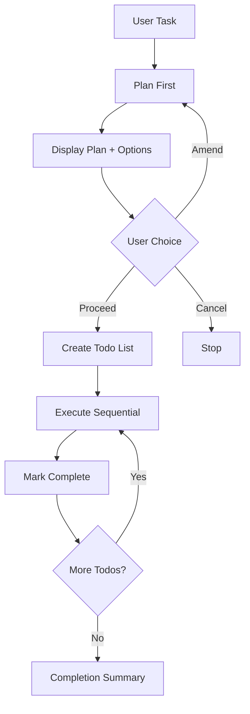

# Mandatory Planning Workflow - Quick Reference

> **Type**: Core Workflow Rule  
> **Status**: ACTIVE - Must be followed for ALL tasks  
> **Integration**: CodingMaster Global Brain  

## 🔄 Workflow Sequence



## ⚡ Quick Actions

### When User Gives Task:
1. **STOP** ✋ - Don't execute immediately
2. **PLAN** 📝 - Create detailed plan
3. **DISPLAY** 📋 - Show plan with options
4. **WAIT** ⏳ - User choice required

### Response Template:
```
## 📋 EXECUTION PLAN
[Your plan]

---
## 🤔 NEXT STEPS - Choose an option:
**🟢 PROCEED** - Execute this plan as-is
**🔴 CANCEL** - Stop and don't execute  
**🔄 AMEND** - Modify the plan (please specify changes)

What would you like to do?
```

### User Responses:
- **"proceed"** → Create todos, execute
- **"cancel"** → Stop, acknowledge
- **"amend [changes]"** → Replan with changes

## 🎯 Key Benefits

✅ **User Control** - No surprise executions  
✅ **Clear Communication** - User knows what will happen  
✅ **Quality Planning** - Better thought-out solutions  
✅ **Risk Mitigation** - Prevent accidental actions  
✅ **Progress Tracking** - Clear todo completion visibility  

## 🚫 Remember: NO EXCEPTIONS

This workflow is **mandatory** for ALL tasks. Always plan first, get approval, then execute.